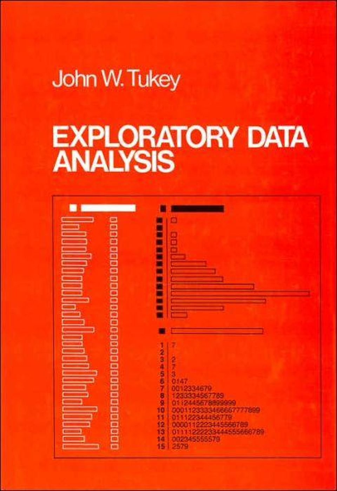
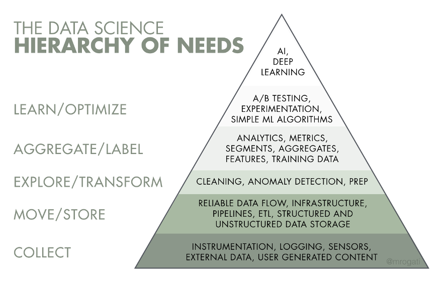

<!-- headingDivider: 2 -->
# What is Data Science?

May 15, 2020 (do we like this color?)
BST 692
Raymond Balise, Ph.D
Layla Bouzoubaa, MSPH

## I've heard of it but what is data science, actually?

## Define

Data **Science** is the practice of using data to try to understand and solve real-world problems.*  

Coined in 2008 as technologies evolved and data became bigger.

A *broad* field. People get into it from all backgrounds and there is an abundance of resources available to get you started or advance.  

Data is **everywhere**. Data scientists will always be in demand.

<!-- _footer: Build a Career in Data Science, 2019 --->

## How the Untrained Do Science

The workflow:  

- Collect data in Excel
- Do summary statistics
- Use the import menu to import into an analysis package
- Do analysis with menus
- Fix problems in Excel
- Use the import menu again
- Point and click to more and more analyses
- Copy and paste numbers into Word
- Copy and paste into PowerPoint

*This is antithetical to reproducible research*

## Data science before it was data science

1977 - John Tukey publishes "Exploratory Data Analysis"

- “For a long time I thought I was a statistician, interested in inferences from the particular to the general. But as I have watched mathematical statistics evolve, I have had cause to wonder and doubt… I have come to feel that my central interest is in data analysis… Data analysis...must take on the characteristics of science rather than those of mathematics… data analysis is intrinsically an empirical science…"

## It's not new

Using data to solve problems is not a new concept - data science has taken several forms:

- this is list item
- this is another list item
- blah blah blah
- more list stuff

## "Sexiest job of the 21st century"

- "make discoveries while swimming in data" :money_with_wings: 
- "identify rich data sources, join them with other, potentially incomplete data sources, and clean the resulting set" :money_with_wings: 
- "help decision makers shift from ad hoc analysis to an ongoing conversation with data" :money_with_wings:
- "communicate what they’ve learned and suggest its implications for new business directions" :money_with_wings:
- "advise executives and product managers on the implications of the data for products, processes, and decisions"
- "...fashion their own tools and even conduct academic-style research" :money_with_wings:
- "hybrid of data hacker, analyst, communicator, and trusted adviser. The combination is extremely powerful—and rare." :money_with_wings:

<!-- _footer: Harvard Business Review, 2012 --->

## Yes, hybrid indeed... 🦸🏼‍♀️

- Math/stats
  - Data Literacy --> techniques exist, how to apply them and how to choose which to try
- Databases/programming
  - R/Python
    - open source
  - SQL
    - manipulate or extract date from databases
  - Version control
    - Git & GitHub

## The DS Hierachy of Needs

yep - even data science has a hieracrchy of needs 

  👉   

## #1 Skill...

### An Intense curiosity
