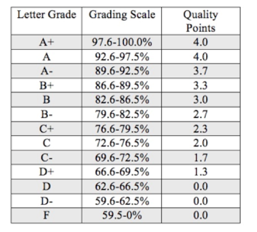

Department of Public Health Sciences  
University of Miami School of Medicine

**BST 692  
Data Science and Machine Learning for Health Research**  
Monday, Wednesday & Friday from 1:00-3:00 PM, CRB 995  
Summer 2020 (May 18 – June 26, 2019)  
(3 credits)  

Instructor of Record:  
Raymond Balise, PhD  
Office: CRB Room 1061  
Phone: 305-243-9694  
E-mail: balise@miami.edu  
Office Hours: by appointment  

Co-Instructor:  
Layla Bouzoubaa, MSPH  
Office: CRB Room 1066  
E-mail: lab218@miami.edu  
Office Hours: by appointment

# Course Description:
BST 692 (3-credits) will teach computational data science techniques using end-to-end data processing pipelines. It will focus on applied data analysis problems that the biostatistics faculty are actively trying to solve.  Students will be presented with data that the faculty are working on and will be asked to apply programming knowledge that they have learned in previous classes.  They will then study and apply new data acquisition, data processing, and machine learning methods to handle problems that are not well handled by common techniques.  The goal of the class is to give students the opportunity to deploy a complete data science pipeline.  Students will apply their data acquisition and exploration skills to real world health research problems; study modern machine learning methods; contrast traditional and new methods to deal with large, complex and messy data; and learn to disseminate results through online, interactive displays.

# Course Learning Objectives:
1.	Understand and be able to apply new/state-of-the-art statistical/data-science methods that are not traditionally taught.
2.	Understand how SAS and R are being used to help deal with modern statistical/data-science problems and be able to apply this knowledge to solve real word problems.
3.	Understand how R works (with GITHUB and Shiny) for sharing results and be able to apply this knowledge to solve real word problems.
4.	Be able to build web-enabled applications to address a statistical or data management problem.

# Course Competencies
1.	Analyze quantitative and qualitative data using biostatistics, informatics, computer-based programming and software, as appropriate.
2.	Interpret results of data analysis for biomedical, medicine, public health research, policy or practice.

# Course Requirements:
Passing grade on BST 625 (or an equivalent class approved by the instructor) and passing grade on the baseline competency exam along with permission of the instructor.

# Order of Lectures and Presentations:
Details are listed in the table below.

# Recommended Readings:
See topic-specific readings.

# Computer Lab
Students will work on their own computers (Mac and Windows will be supported).

# Software
During the class, the following software will be utilized:  

+	R: http://cran.r-project.org/
+	R Studio desktop:  http://www.rstudio.com/products/rstudio/download/  

## Grading/Evaluation:
You can collaborate (groups less than 5 people) on all parts of this class except the in-class final exam. There are 14 assignments (each worth 3 points).  Each assignment is a piece of the puzzle in making an interactive web application.  There is a final project combining all the work from the assignments into an interactive web app which will predict breaking addiction using traditional and machine learning methods (worth 37 points).   There is a timed in class presentation of the final project where groups will show their work (worth 10 points).  Consider the final presentation as a job interview.  Students who do not have extensive job interviewing or timed presentation skills should contact the Toppel Career Center for training on interviewing and presenting. Every student in each group must present and be prepared to answer questions on every aspect of the project.  There is an in class final exam (true/false, multiple choice, matching etc.) worth 11 points.  Grades will be based on the percentage of the total points achieved by the best student.  In theory, a student who does perfectly on everything could set the curve based on 42 + 37 + 10 + 11 = 100 points possible.  

Dates will be added below if the biostatistics faculty approve the outline/plan

+	Module 1 – Introduction to Data Science
        + Assignment 0
+	Module 2 – Load and understand data in a pipeline
    + Load data via API
        + Assignment 1
    + Do descriptive statistics on individual tables
        + Assignment 2
    + Merge tables with SQL
        + Assignment 3
    + Make a markdown document with results
        + Assignment 4
    + Write a package that includes all the code needed and documents the data
        + Assignment 5
    + Use Drake to control pipeline
        + Assignment 6
+ Module 3 – Add analysis to the pipeline
    + Predict treatment success with many methods
        + Assignment 7 – logistic
        + Assignment 8 – KNN
        + Assignment 9 - SVM
        + Assignment 10 Random Forest
+ Module 4 – Add web output to the pipeline
        + Assignment X
        + Assignment XX
        + Assignment XXX
+	Final Presentation

# Grading
Grades will be assigned using the following percentages:

# Department Policies
The Department of Public Health Sciences is committed to fostering an environment that supports the promotion of public health values and is conducive to professionalism and ethical standards for the responsible conduct of science and education.  

The University of Miami expects all graduate students to adhere to the highest standards of ethics and academic integrity. All forms of academic fraud are strictly prohibited. These include, but are not limited to, plagiarism and/or cheating (whether it be in an examination, dissertation, thesis, research paper, research project, form of creative expression, experimental data, or any other academic undertaking).  

Students found to be in violation of these standards are subject to disciplinary actions through the process described in the University of Miami Graduate Student Honor Code (https://grad.miami.edu/_assets/pdf/graduate_student_honor_code_2016_2017.pdf).

# Plagiarism
Plagiarism is representing the words or ideas of someone else as one’s own. Examples include failing to cite direct quotes properly and failing to give credit for someone else’s ideas or materials. If students are unsure whether a practice is acceptable, they are urged to discuss the issue with the faculty instructor, the UM Writing Center, or refer to the links provided below:

1.  What It is and How to Recognize and Avoid It  
    - Indiana University Writing Tutorial Services
    - http://www.indiana.edu/~wts/pamphlets/plagiarism.shtml
2.  Citing Sources and Avoiding Plagiarism: Documentation
    - Duke University Libraries Guide
    - https://library.duke.edu/research/citing
3. What are the differences among quoting, paraphrasing, and summarizing?
    - University of Wisconsin Writer’s Handbook
    - http://www.wisc.edu/writing/Handbook/QuotingSources.html
4. Using Quotations
    - St. Cloud University
    - http://leo.stcloudstate.edu/research/usingquotes.html
5. Plagiarism tutorial
    - Vaughan Memorial Library, Acadia University
    - http://library.acadiau.ca/tutorials/plagiarism/
6. Avoiding plagiarism, self-plagiarism, and other questionable writing practices
    - Michigan State University
    - http://www.cse.msu.edu/~alexliu/plagiarism.pdf

# University of Miami Writing Center
The Writing Center strives to help all members of the university community learn more about writing and become better writers. Their faculty and tutors work one-on-one with students to discuss course papers, dissertations, personal statements, grant proposals, articles for publication and personal writing projects. To make an appointment, call (305) 284-2956 or visit the website www.as.miami.edu/writingcenter.

# Holy Day Policy for Absences
A recent Faculty Senate decision has been made for how instructors must handle the situation of religious holidays and attendant missed classes by students. The solution adopted by the Faculty Senate and University Administration is to allow students to take off any religious holiday of his or her choice as a matter of right, but only if the student discloses her or his specific intentions to the faculty member in writing within the first three days of class meeting. Students, at the discretion of the instructor, may be required to make up any assignments or examinations missed due to absences for religious holidays.

# Course Schedule
### Module 1 – What is Data Science?

Configure your machine before May 18th.  See Assignment 0.

+ Windows
    + [Configure a Windows PC for Data Science](https://derailment.netlify.com/2019-11-01-configure-a-windows-pc-for-data-science/)
    + [Installing R/RStudio on Windows](https://derailment.netlify.com/2019-12-10-installing-r-rstudio-on-windows/)
    + [Configuring R/RStudio](https://derailment.netlify.com/2019-12-22-configuring-rstudio/)
    + [Configure GitHub with GitKraken](https://derailment.netlify.com/2020-04-10-configure-github-with-gitkraken/)
+ Mac
    + [Configure a Mac for Data Science](https://derailment.netlify.com/2019-10-29-configure-a-mac-for-data-science/)
    + [Installing R/RStudio on a Mac](https://derailment.netlify.com/2019-11-16-installing-r-rstudio-on-a-mac/)
    + [Configuring R/RStudio](https://derailment.netlify.com/2019-12-22-configuring-rstudio/)
    + [Configure GitHub with GitKraken](https://derailment.netlify.com/2020-04-10-configure-github-with-gitkraken/)

|Date                | Session/Objectives              | Readings | Assignments |        
|--------------------|---------------------------------|----------------|------|
| **05/18**          | **What is Data Science?**       |                |              |
| Balise & Bouzoubaa | 1. Understanding what is data science |          | Assignment 0 |
|                    |                                 |                | Assignment 1 |
|                    | 2.	Undstand data processing pipeliens |          |              |
|                    | 3.	Understand the types of Jobs      |           |              |
|                    | 4.	Understand Data Science Hierarchy of Needs |  |              |

### Module 2 - Databases and Programming
| Date               | Session/Objectives | Readings | Assignments |        
|--------------------|-----------------------|-----------------|----------------|
| **05/18 & 5/20**   | **Pipelines/UNIX/Git/Github**              | | |
| Balise & Bouzoubaa | 1. Understand the process of creating a DS pipeline   | | |
|                    | 2. UNIX pipelines | http://swcarpentry.github.io/shell-novice/ | |
|                    | 3. Understand and know how to use version control with Git | http://swcarpentry.github.io/git-novice/ | |
|                    | 4. Understand and know how to use GitHub | | |
| **05/22**          | **Programming in Tidyverse**              | | |
| Balise & Bouzoubaa | 5. Review and Expand from BST 625 - Understand and know how to use the Tidyverse (dplyr, ggplot, purrr, etc)  | | |
| **05/25**          | **Holiday**              | | |
| **05/27**          | **Data Acquisition**               | | |
| Balise & Bouzoubaa | 6. Understand what an API is   | | |
|                    | 7. How to pull data from RedCap via API   | | |
| **05/27**          | **SQL**              | | |
| Balise             | 8. Understand know how to write SQL calls   | | |
|                    | 9. Understand how SQL relates to the tidyverse | | |
| **05/29**          | **Explore & Transform**              | | |
| Balise & Bouzoubaa | 10.	Know how to do exploratory data analysis in R (with DataExploreR and Janitor)  | | |
| **06/01**          | **Packages**  | | |
| Balise             | 11.	Know how to create your own R package   | | |
|                    | 12.	Understand what is a package and why bother | | |
|                    | 13.	Unstand the tools used to make a package | | |
|                    | 14.	Understand the files and directories that make an R package | | |
|                    | 15.	Know how to add documentation to a package | | |
| **06/03**          | **Reproducibility**              | | |
| Bouzoubaa          | 16.	Understand the importance of scientific replicability | https://ropenscilabs.github.io/drake-manual/index.html#installation  & learndrake R package & https://wlandau.shinyapps.io/drakeplanner  | |
|                    | 17.  Drake package   | | |
|                    | a.	Know how to rebuild intermediate data objects when dependencies change | | |
|                    | b.	Know how to build a drake controlled pipeline | | |
|                    | 17.  R Markdown and Friends   | | |

### Module 3 - Statistics and Algorithms
|  Date               | Session/Objectives | Readings | Assignments |        
|--------------------|-------------------------------|---------|----------------|
| **06/05**          | **Intro to Machine Learning**              | | |
| Balise             | 1. Be able to explain What is ML?  | | |
|                    | 2. Understand the the philosophical/practical differences between machine learning and statistics | | |
|                    | 3. Understand when the common ML algorithms should and should not be used | | |
|                    | 4. Understand and know how to make well built training and test sets | | |
|                    | 5. Understand and know how to do cross validation with caret package | | |
| **06/08 & 6/10**   | **Supervised Machine Learning**              | | |
| Balise             | 1. Understand what is supervised ML? | | |
|                    | 2. Understand and be able to do traditional and machine learning classification with: | | |
|                    | a. Logisitic Regression | | |
|                    | b. K Nearest Neighbors | | |
|                    | c. SVM | | |
|                    | d. Random Forest | | |
| **06/12**          | **Unsupervised Machine Learning**              | | |
| Balise             | 1. Understand what is unsupervised ML? | | |
|                    | 2.	Understand and be able to do unsupervised learning  | | |
|                    | a.	Market Basket Analyses | | |
|                    | b.	K-means | | |
| **06/15**          | **Model Interpretation**              | | |
| Bouzoubaa          | 1.	Interpret ML models | | |
|                    | a.	How input variables are used | | |
|                    | b.	Know the impact of particular variables on final model predictions | | |
|                    | 2.	DALEX package | http://dalex.drwhy.ai/index.html#introduction | |
|                    | a.	Extract useful information from several model parameters | | |

### Module 4 - Statistics and Algorithms
|Date                | Session/Objectives                     | Readings | Assignments |  
|--------------------|----------------------------------------|------|----------|
| **06/17, 06/19, 6/22, 6/24**  | **Shiny**              | | |
| Bouzoubaa          | 1.	Understand the how Shiny works | https://mastering-shiny.org/ & http://shiny.rstudio.com/tutorial/ | |
|                    | 2.	Understand how HTML works | | |
|                    | 3.	Understand input controls | | |
|                    | 4.	Understand Shiny server objects | | |
|                    | 5.	Know how to make an interactive object | | |
|                    | 6.	Understand server functions – reactive() and observe() | | |
|                    | 7.	Understand layouts | | |
|                    | 8.	Understand Plotyly | | |
|                    | 9.	Know how to deploy on ShinyApps.io | | |
| **06/25**          | **Help Session**              | | |
| Balise & Bouzoubaa |   | | |
| **06/26**          | **Final**              | | |
| Balise & Bouzoubaa | In class conceptual final  | | |
|                    | In class presentations   | | |

# About the instructors:
**Raymond R. Balise** began typing in 8th grade.  He mastered both pointing and clicking with a mouse using the very first Macintosh computer as a freshman in college.  Between his sophomore and junior years in college, he got his own Mac and began doing data analysis on a state-of-the-art 20 MB hard drive. After completing his PhD in Experimental Psychology from the University of Texas, he applied his elite typing skills to teaching and doing research on gene/environment interactions in cancer at Stanford University.  During his 17 years there, he was an award-winning lecturer who developed and taught HRP 223 Data Management and Statistical Programming.  He joined the University of Miami in 2014.  At UM he has taught Survey of Statistical Computing, Medical Biostatistics, Case Studies in Biostatistics, and Data Science and Machine Learning.  He has also applied his masterful typing to a book, Presenting Medical Statistics from Proposal to Publication, and more than a hundred peer-reviewed publications and refereed presentations in topics including phonetics to obstetrics, dyspepsia to dyslexia and health disparity to brachytherapy.  Now you can often find him with fingers on a keyboard looking at computer monitors showing HIV, substance abuse or health disparity data.

**Layla Bouzoubaa** is a Lead Research Analyst for the University of Miami (UM) Miller School of Medicine's Department of Public Health Sciences (DPHS). Additionally, she is the lead Statistical Programmer for UM's Sylvester Comprehensive Cancer Center's (SCCC) Division of Population Health & Cancer Disparities and SCAN360.com. Currently, she is working in substance abuse research to help target interventions to patients suffering from opioid addiction which includes developing Shiny Apps for resource mapping, data harmonization, and population statistics/visualizations to building models that will inform proper treatment. Layla also has the pleasure of co-instructing "Data Science for Biostatistics", a 6-week summer course for masters and PhD level students within DPHS.
Outside of business hours, Layla co-organizes the Miami chapter of R-Ladies, an international organization that promotes gender equity among the data science community, and Google Developers Group (GDG) Miami, a community group that encourages and enables the discussion of new technologies in South Florida. She also co-organizes the annual Women in Data Science (WiDS) Miami conference, is a Google Women Techmaker (WTM) ambassador, and is a facilitator of Google's #IamRemarkable initiative
Aside from her professional loves, Layla is an over-zealous plant mom and a wannabe wine connoisseur and food critic.
